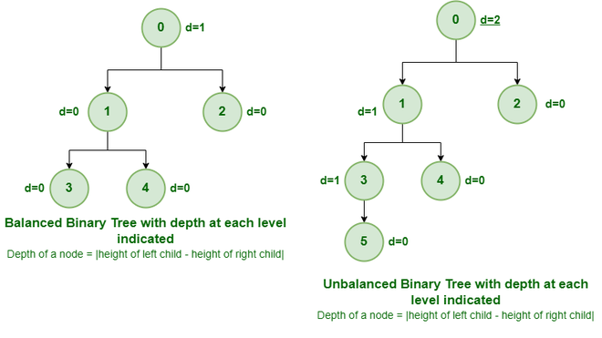

# Balanced Binary Search Tree (BST)
## Introduction
This project involves building a **Balanced Binary Search Tree (BST)** from scratch. The BST enables fast operations for **lookup, insertion, and deletion** of data items, ensuring efficiency and organization. Additionally, the implementation includes various **tree traversal algorithms**, methods for **balancing the tree**, and utilities for measuring tree properties like height and depth.



## Features
- **Node Class**: Represents a tree node with `data`, `left`, and `right` attributes.
- **Tree Class**: Accepts an array and builds a balanced BST.
- **buildTree(array)**: Constructs a balanced BST from an array (removes duplicates and sorts it).
- **insert(value)**: Inserts a value into the BST while maintaining its properties.
- **deleteItem(value)**: Deletes a value from the BST, handling different node cases.
- **find(value)**: Finds and returns the node with the given value.
- **Traversal Methods**:
  - **levelOrder(callback)**: Traverses the tree in breadth-first order.
  - **inOrder(callback)**: Traverses the tree in in-order depth-first order.
  - **preOrder(callback)**: Traverses the tree in pre-order depth-first order.
  - **postOrder(callback)**: Traverses the tree in post-order depth-first order.
- **height(node)**: Returns the height of a given node.
- **depth(node)**: Returns the depth of a given node.
- **isBalanced()**: Checks if the tree is balanced.
- **rebalance()**: Rebalances an unbalanced tree.
- **Driver Script**: Demonstrates the entire implementation step-by-step.

## Setup & Usage
1. Clone the repository:
   ```sh
   git clone https://github.com/mkatfi/projects-JavaScript/tree/main/Binary-Search-Trees
   cd Binary-Search-Trees
   ```
2. Run the JavaScript file in Node.js:
   ```sh
   node main.js
   ```
3. The script will:
   - Build a **balanced BST** from a random array.
   - Confirm balance using `isBalanced()`.
   - Print traversals (level-order, in-order, pre-order, post-order).
   - Unbalance the tree by inserting values > 100.
   - Confirm the tree is **unbalanced**.
   - Rebalance the tree using `rebalance()`.
   - Confirm the tree is **balanced again**.
   - Print the traversals again.

## Example Output
```
Original Tree
│           ┌── 6345
│       ┌── 324
│   ┌── 67
│   │   │   ┌── 23
│   │   └── 9
└── 8
    │       ┌── 7
    │   ┌── 5
    └── 4
        │   ┌── 3
        └── 1
8
4
67
1
5
9
324
3
7
23
6345

After inserting 10

│           ┌── 6345
│       ┌── 324
│   ┌── 67
│   │   │   ┌── 23
│   │   │   │   └── 10
│   │   └── 9
└── 8
    │       ┌── 7
    │   ┌── 5
    └── 4
        │   ┌── 3
        └── 1

After deleting 9

│           ┌── 6345
│       ┌── 324
│   ┌── 67
│   │   └── 23
│   │       └── 10
└── 8
    │       ┌── 7
    │   ┌── 5
    └── 4
        │   ┌── 3
        └── 1

find Node { data: 10, left: null, right: null }

==> In-order traversal
1
3
4
5
7
8
10
23
67
324
6345

==> Pre-order traversal
8
4
1
3
5
7
67
23
10
324
6345

==> Post-order traversal
3
1
7
5
4
10
23
6345
324
67
8

Height of root: 3

Depth of node with value 9: 3

│           ┌── 6345
│       ┌── 324
│   ┌── 67
│   │   └── 23
│   │       └── 10
└── 8
    │       ┌── 7
    │   ┌── 5
    └── 4
        │   ┌── 3
        └── 1
Is tree balanced? true

After inserting 10000:

│               ┌── 10000
│           ┌── 6345
│       ┌── 324
│   ┌── 67
│   │   └── 23
│   │       └── 10
└── 8
    │       ┌── 7
    │   ┌── 5
    └── 4
        │   ┌── 3
        └── 1

Is tree balanced? false

After rebalancing:
│           ┌── 10000
│       ┌── 6345
│       │   └── 324
│   ┌── 67
│   │   │   ┌── 23
│   │   └── 10
└── 8
    │       ┌── 7
    │   ┌── 5
    └── 4
        │   ┌── 3
        └── 1

Is tree balanced? true
```

## Visualization
To visualize your BST, use the `prettyPrint()` function provided in the assignment:
```js
const prettyPrint = (node, prefix = "", isLeft = true) => {
  if (node === null) return;
  if (node.right !== null) prettyPrint(node.right, `${prefix}${isLeft ? "│   " : "    "}`, false);
  console.log(`${prefix}${isLeft ? "└── " : "┌── "}${node.data}`);
  if (node.left !== null) prettyPrint(node.left, `${prefix}${isLeft ? "    " : "│   "}`, true);
};
```

## Resources
- [Binary Search Trees - Insertion & Deletion](https://www.geeksforgeeks.org/binary-search-tree-set-1-search-and-insertion/)
- [Tree Traversal Algorithms](https://www.geeksforgeeks.org/tree-traversals-inorder-preorder-and-postorder/)
- [Building a Balanced BST](https://www.youtube.com/watch?v=U0R0HaY1V5s)


---
**Happy Coding! 🚀**

