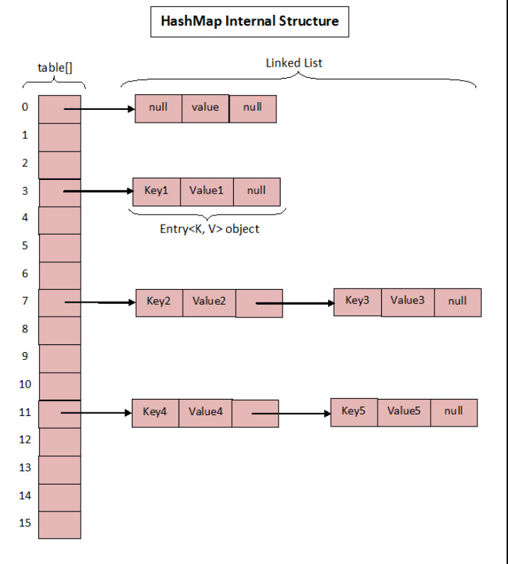

# HashMap Implementation in JavaScript

## Overview
This project implements a **HashMap** (or Hash Table) in JavaScript. A HashMap is a data structure that stores key-value pairs and allows efficient insertion, deletion, and lookup operations.

## Features
- **Insertion (`set(key, value)`)**: Adds or updates a key-value pair.
- **Retrieval (`get(key)`)**: Fetches the value associated with a key.
- **Deletion (`remove(key)`)**: Removes a key-value pair.
- **Checking existence (`has(key)`)**: Checks if a key exists.
- **Resizing (`resize()`)**: Doubles the capacity when the load factor exceeds **0.75**.
- **Key retrieval (`keys()`)**: Returns all keys.
- **Value retrieval (`values()`)**: Returns all values.
- **Entry retrieval (`entries()`)**: Returns all key-value pairs.
- **Clearing (`clear()`)**: Removes all elements.
- **String representation (`toString()`)**: Returns a formatted string of key-value pairs.

## Performance
- **Average Case Complexity:**
  - `set()`, `get()`, and `remove()` operate in **O(1)** time on average.
- **Worst Case Complexity:**
  - If too many collisions occur, operations degrade to **O(n)** in the worst case.

## License
This project is open-source and available under the **MIT License**.

## Installation & Usage
```javascript
const map = new HashMap();
map.set("name", "Alice");
console.log(map.get("name")); // Output: Alice

```
---

### **Summary**
| Method | Purpose |
|--------|---------|
| `hash(key)` | Converts a key to an index. |
| `set(key, value)` | Adds/updates a key-value pair. |
| `get(key)` | Retrieves a value. |
| `has(key)` | Checks if a key exists. |
| `remove(key)` | Deletes a key-value pair. |
| `resize()` | Expands capacity when needed. |
| `length()` | Returns the number of key-value pairs. |
| `keys()` | Returns all keys. |
| `values()` | Returns all values. |
| `entries()` | Returns all key-value pairs. |
| `clear()` | Removes all data. |
| `toString()` | Displays the hash map. |

---
**Happy Coding! 🚀**