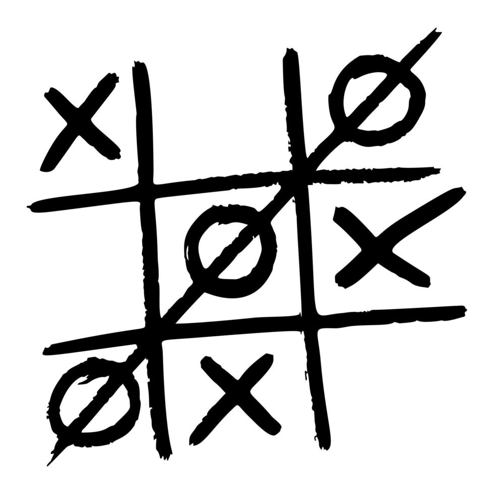

# Tic-Tac-Toe Game

## Overview
This project is a **Tic-Tac-Toe** game built using HTML, CSS, and JavaScript. It follows a modular design pattern using objects and factories to handle the game logic, players, and gameboard. The project ensures minimal global code by encapsulating functionalities inside objects and modules.

## Features
- **Gameboard Module:** Stores the 3x3 game board as an array.
- **Player Factory:** Creates player objects with names and markers (X or O).
- **Game Controller:** Manages game flow, player turns, and win conditions.
- **DOM Controller:** Updates the webpage dynamically based on game state.
- **Interactive UI:** Allows users to input names, click on the board to play, and restart the game.
- **Win Checking:** Determines wins, losses, and ties.

## Technologies Used
- **HTML**: Structuring the game elements.
- **CSS**: Styling the game board and UI.
- **JavaScript**: Handling game logic and interactions.

## Installation & Setup
1. Clone the repository:
   ```sh
   git clone https://github.com/mkatfi/projects-JavaScript/tree/main/Project_Tic-Tac-Toe
   ```
2. Navigate to the project folder:
   ```sh
   cd Project_Tic-Tac-Toe
   ```
3. Open `index.html` in your browser.

## How to Play
1. Enter player names.
2. Click on a board square to place your mark.
3. The game will switch turns automatically.
4. The game announces the winner or a tie when the board is full.
5. Click "Restart" to play again.

## Code Structure
```
📂 Project_Tic-Tac-Toe/
├── 📄 index.html   # Main HTML file   
├── 📂 js
│   ├── 📄 main.js
├── 📂 css
│   ├── 📄 index.css
├── 📂 image
├── 📄 README.md    # Project Documentation
```

### **Game Logic Summary**
| Component | Description |
|-----------|------------|
| `Gameboard` | Stores the board state and updates the grid |
| `Player` | Represents a player with a name and marker (X or O) |
| `GameController` | Manages turns, checks for winners/ties, and resets the game |
| `DOMController` | Handles user input and updates the UI dynamically |

## Future Enhancements
- Add animations for moves.
- Implement AI for single-player mode.
- Save game progress using local storage.

---
**Happy Coding! 🚀**

